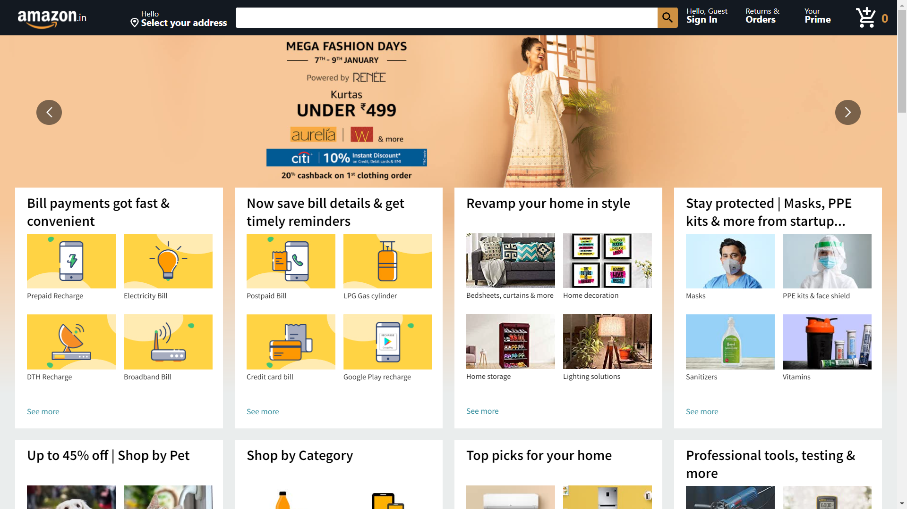

# Amazon Clone React App ([Visit](https://clone-75de4.web.app/))

It is a fully responsive amazon clone website. I have followed the Clever Programmers (Big Thanks to them!) tutorial on youtube. Later I fully customized it like the original amazon website. I tried to add as many features as possible with my current knowledge skills. This is an interactive react app made using react hooks and some firebase backend functionalities. It is a website with beautiful UI and great user experience. It has different other components and key features like:

## Active Pages
- Login Page
- Sign Up Page
- Home Page
- Product Details Page
- My Cart
- Payment Page
- Order Details page

## Key Features
- Login/Sign up functionality using Firebase Authentication
- Shopping Cart Functionality using Redux concept.
- Orders page using real-time database (Firebase functions)
- Dynamic rendering of product details page.
- Payment processing using stripe.

### Screenshot

 

### What I learned

In this challenge I learned about 

- React Components
- `useState` hooks
- Redux
- Applying Firebase authentication
- Dynamic page rendering
- Applying payment functionality using stripe
- Connecting backend with realtime database
